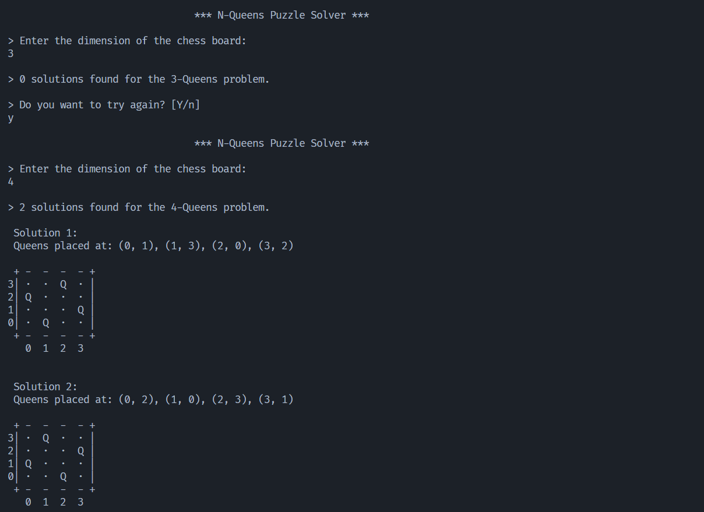

# N-Queens Solver in Java

The N-Queens problem (generalized [Eight queens puzzle](https://en.wikipedia.org/wiki/Eight_queens_puzzle)) involves placing N queens on an NxN chessboard such that no two queens threaten each other.

This project is a minimalistic Java implementation of a CLI solver for the N-Queens problem that gives all possible solutions for a given N.

